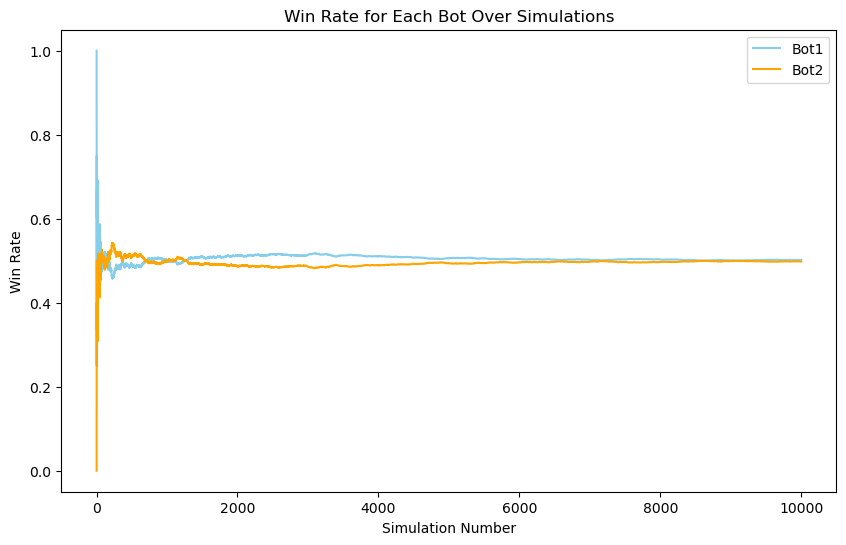
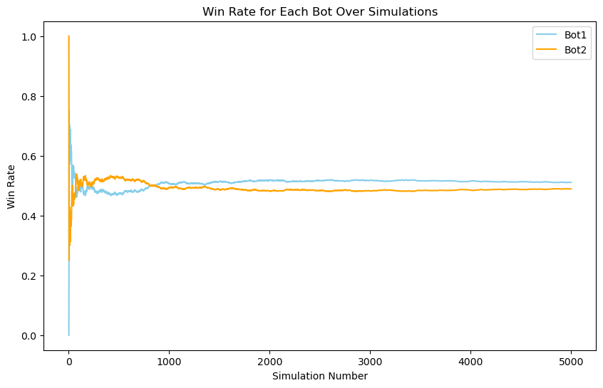

# 🎮 UNO Game with Monte Carlo Tree Search AI

This project implements the popular **UNO card game** with a **Graphical User Interface (GUI)** and extends it with multiple **AI agents** for automated gameplay.  
It includes **Random bots**, **Monte Carlo Tree Search (MCTS)** bots, and experimental **Reinforcement Learning (RL)** agents to analyze strategies and performance.  

---

## 🏗️ Features
- Full **UNO game with GUI**  
- **AI agents** implemented:
  - RandomBot (baseline)  
  - MonteCarloBot (simulation-based)  
  - MCTSBot & MCTSRandomBot (Monte Carlo Tree Search)  
  - Reinforcement Learning prototype (Python)  
- Simulation environment to evaluate bots over thousands of games  
- Visualization of **win rate** and **game length distributions**  

---

## 📊 Results & Visualizations

### 🔹 First and initial version of Monte Carlo bot against bot with heurestic 
Shows how many turns UNO games typically take.  


---

### 🔹 Win Rate Comparison (Random Bot vs Monte Carlo Bot)


---

### 🔹 Monte Carlo Tree Search Win Rate


---

## ⚙️ Tech Stack
- **Java** – Core UNO game logic & GUI, AI agents (Random, Monte Carlo, MCTS)  
- **Python** – Reinforcement Learning experiments  
- **Matplotlib / Numpy** – Simulation results visualization  

---

## 🚀 Getting Started

### Run the UNO Game
```bash
# Compile and run Java project
javac *.java
java Main
