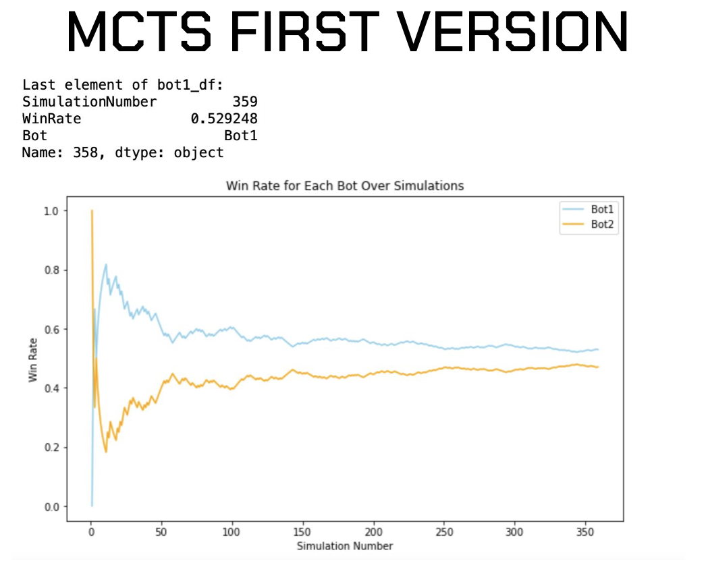

# 🎮 UNO Game with Monte Carlo Tree Search AI

This project implements the popular **UNO card game** with a **Graphical User Interface (GUI)** and extends it with multiple **AI agents** for automated gameplay. 

**Our best **Monte Carlo Tree Search bot** for UNO achieves a **0.63 higher win rate** against a heuristic-based bot.  
For comparison, the best results reported online were around **0.57**, so this is a **significant improvement** in a game with strong elements of chance.**  

It includes **Random bots**, **Monte Carlo Tree Search (MCTS)** bots, and experimental **Reinforcement Learning (RL)** agents to analyze strategies and performance.  


---

## 🏗️ Features
- Full **UNO game with GUI**  
- Multiple **AI agents**:
  - `RandomBot` (baseline)  
  - `MonteCarloBot` (simulation-based)  
  - `MCTSBot` & `MCTSRandomBot` (Monte Carlo Tree Search variants)  
  - Reinforcement Learning prototype (Python)  
- Simulation environment for large-scale bot evaluation  
- Visualization of **win rates** and **game length distributions**  

---

## 📊 Results & Visualizations

### 🔹 Initial Monte Carlo Bot vs. Heuristic Bot


---

### 🔹 Win Rate Comparison: Random Bot vs. Improved Monte Carlo Bot


---

### 🔹 Further Improved: MCTS with Opponent Hand Estimation


---

## ⚙️ Tech Stack
- **Java** – Core UNO game logic, GUI, AI agents (Random, Monte Carlo, MCTS)  
- **Python** – Reinforcement Learning experiments  
- **Matplotlib / NumPy** – Results visualization  

---

## 🚀 Getting Started

### Run the UNO Game
```bash
# Compile and run the Java project
javac *.java
java Main
